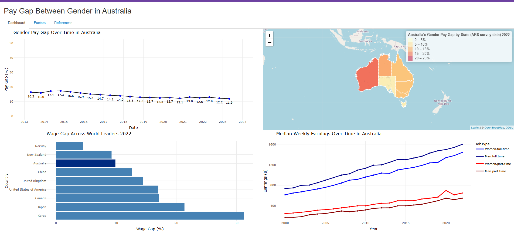

# Gender Pay Gap Dashboard

An interactive Shiny dashboard that visualizes the gender pay gap in Australia across various dimensions. This project uses open datasets to provide insights into trends over time, industry-specific differences, and the impact of factors like study level, age, and state.

---

## Table of Contents
- [Introduction](#introduction)
- [Features](#features)
- [Dataset](#dataset)
- [Technologies Used](#technologies-used)
- [Live Dashboard](#live-dashboard)
  - [Screenshot](#screenshot)
- [How to Run Locally](#how-to-run-locally)
- [Acknowledgements](#acknowledgements)


---

## Introduction

This dashboard was created as part of a data visualization project to analyze the gender pay gap in Australia. It uses publicly available datasets to highlight key trends and differences in pay by gender across states, industries, and education levels. The dashboard provides users with a comprehensive view of how the gender pay gap evolves over time and what factors influence it.

---

## Features

- **Interactive Charts**: Visualize trends in gender pay gaps by state, age, industry, and study level.
- **Dynamic Map**: Explore pay gap variations across Australian states using geospatial data.
- **Filters**: Adjust parameters such as year, gender, and education level to customize the visualizations.
- **Insights**: Get a summary of key trends and actionable insights.

---

## Dataset

The following datasets were used to build the dashboard:

- [Gender pay gap guide by Australian Bureau of Statistics, accessed 22 Oct 2023](https://www.abs.gov.au/statistics/understanding-statistics/guide-labour-statistics/gender-pay-gap-guide)
- [Average Weekly Earnings, Australia by Australian Bureau of Statistics, accessed 22 Oct 2023](https://www.abs.gov.au/statistics/labour/earnings-and-working-conditions/average-weekly-earnings-australia/latest-release#data-download)
- [Gender wage gap, OECD data, accessed 22 Oct 2023](https://data.oecd.org/earnwage/gender-wage-gap.htm)
- [GOS Graduates Outcomes Survey - short-term graduate outcomes in Australia, accessed 22 Oct 2023](https://www.qilt.edu.au/docs/default-source/default-document-library/2022-gos-national-report.pdf?sfvrsn=c5d342c8_2)
- [WGEA Scorecard 2022: The state of gender equality in Australia, accessed 22 Oct 2023](https://www.wgea.gov.au/publications/australias-gender-equality-scorecard)
- [The ABS data gender pay gap, accessed 22 Oct 2023](https://www.wgea.gov.au/data-statistics/ABS-gender-pay-gap-data)
- [Gender indicators, Australia by Australian Bureau of Statistics, accessed 22 Oct 2023](https://www.abs.gov.au/statistics/people/people-and-communities/gender-indicators)
- [How to make Interactive WebApps using R Shiny, by Sahiti Kappagantula, accessed 22 Oct 2023](https://medium.com/edureka/r-shiny-tutorial-47b050927bd2)
- [shinydashboard, GitHub, accessed 22 Oct 2023](https://rstudio.github.io/shinydashboard/get_started.html)

---

## Technologies Used

- **R Programming Language**: For building the Shiny dashboard.
- **Shiny**: Interactive web application framework.
- **ggplot2**: For creating data visualizations.
- **Leaflet**: For interactive maps.
- **Plotly**: For dynamic and responsive charts.
- **sf**: For handling geospatial data.

---

## Live Dashboard

You can view the live dashboard here:  
[Gender Pay Gap Dashboard](https://b00epq-chamodi0madara0premachandra-iddamalgoda0dissanayaka.shinyapps.io/Assignment03/)

### Screenshot

Here’s an overview of the dashboard:




---

## How to Run Locally

1. Clone the repository:
   ```bash
   git clone https://github.com/ChamodiMadara/Gender-Pay-Gap-Dashboard.git
   cd Gender-Pay-Gap-Dashboard```
2. Open the R Markdown file:
   - Open the `GenderPayGapDashboard.Rmd` file in RStudio.

3. Install required R packages:
   - Ensure all required libraries are installed by running the code chunks in the `.Rmd` file.  
     Alternatively, manually install the necessary packages with:
     ```R
     install.packages(c("shiny", "shinyalert", "ggplot2", "lubridate", 
                        "dplyr", "plotly", "leaflet", "sf", "tidyr", "reshape2"))
     ```

4. Render or run the dashboard:
   - Click the "Knit" button in RStudio to render the `.Rmd` file into an `.html` file.
   - If the file generates a live Shiny app, run the chunks that launch the dashboard directly in RStudio.

5. View the dashboard:
   - If an `.html` file is generated, open it in your browser.
   - If the dashboard is a Shiny app, it will automatically launch in your browser.
---
## Acknowledgements

This dashboard was developed as part of an academic project for **MATH2270/MATH2237/MATH2404**.

I would like to thank:

- **Australian Bureau of Statistics** and **WGEA** for providing the open datasets used in this project.
- The **R community** for creating the libraries and tools that made this project possible.
- My mentors and instructors for their guidance and support during this project.

This dashboard reflects my passion for data visualization and my commitment to exploring meaningful insights through data.
